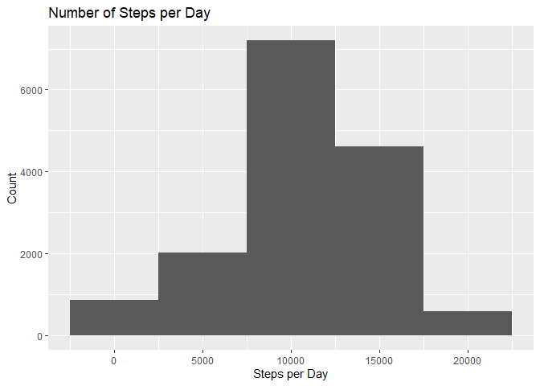
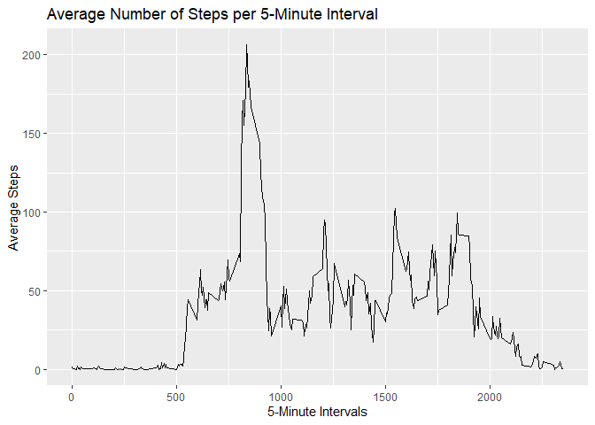
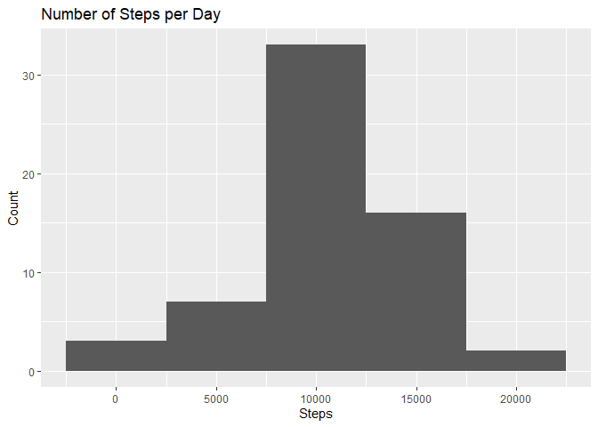
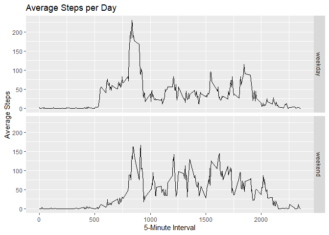

## Loading and preprocessing the data

The first step is to download, unzip, and examine the data.


```r
if(!file.exists("./Project")){dir.create("./Project")}
fileURL <- "https://d396qusza40orc.cloudfront.net/repdata%2Fdata%2Factivity.zip"
download.file(fileURL, destfile = "./Project/Dataset.zip",              method = "curl")
```


```r
names <- unzip("./Project/Dataset.zip", list = TRUE)
names
```

```
##           Name Length                Date
## 1 activity.csv 350829 2014-02-11 10:08:00
```


```r
unzip("./Project/Dataset.zip", exdir = "./Project")
list.files("./Project") 
```

```
## [1] "activity.csv" "Dataset.zip"
```


```r
library(tidyverse)
```

```
## Warning: package 'tidyverse' was built under R version 3.6.1
```

```
## -- Attaching packages ---------------------- tidyverse 1.2.1 --
```

```
## v ggplot2 3.2.0     v purrr   0.3.2
## v tibble  2.1.3     v dplyr   0.8.3
## v tidyr   0.8.3     v stringr 1.4.0
## v readr   1.3.1     v forcats 0.4.0
```

```
## Warning: package 'tidyr' was built under R version 3.6.1
```

```
## Warning: package 'readr' was built under R version 3.6.1
```

```
## Warning: package 'dplyr' was built under R version 3.6.1
```

```
## Warning: package 'forcats' was built under R version 3.6.1
```

```
## -- Conflicts ------------------------- tidyverse_conflicts() --
## x dplyr::filter() masks stats::filter()
## x dplyr::lag()    masks stats::lag()
```

```r
activity <- read_csv("./Project/activity.csv")
```

```
## Parsed with column specification:
## cols(
##   steps = col_double(),
##   date = col_date(format = ""),
##   interval = col_double()
## )
```

```r
str(activity)
```

```
## Classes 'spec_tbl_df', 'tbl_df', 'tbl' and 'data.frame':	17568 obs. of  3 variables:
##  $ steps   : num  NA NA NA NA NA NA NA NA NA NA ...
##  $ date    : Date, format: "2012-10-01" "2012-10-01" ...
##  $ interval: num  0 5 10 15 20 25 30 35 40 45 ...
##  - attr(*, "spec")=
##   .. cols(
##   ..   steps = col_double(),
##   ..   date = col_date(format = ""),
##   ..   interval = col_double()
##   .. )
```

```r
head(activity)
```

```
## # A tibble: 6 x 3
##   steps date       interval
##   <dbl> <date>        <dbl>
## 1    NA 2012-10-01        0
## 2    NA 2012-10-01        5
## 3    NA 2012-10-01       10
## 4    NA 2012-10-01       15
## 5    NA 2012-10-01       20
## 6    NA 2012-10-01       25
```

## What is mean total number of steps taken per day?

Calculate the total number of steps taken per day. 


```r
activity1 <- activity %>% filter(!is.na(steps)) %>% 
    group_by(date) %>% mutate(stepsperday = sum(steps))
head(activity1)
```

```
## # A tibble: 6 x 4
## # Groups:   date [1]
##   steps date       interval stepsperday
##   <dbl> <date>        <dbl>       <dbl>
## 1     0 2012-10-02        0         126
## 2     0 2012-10-02        5         126
## 3     0 2012-10-02       10         126
## 4     0 2012-10-02       15         126
## 5     0 2012-10-02       20         126
## 6     0 2012-10-02       25         126
```

Make a histogram of the total number of steps taken per day.


```r
activity1 %>% ggplot(aes(stepsperday)) + 
    geom_histogram(binwidth = 5000) + ggtitle("Number of Steps per Day") + xlab("Steps per Day") + 
    ylab("Count")
```

<!-- -->

Calculate and report the mean and median of the total number of steps taken per day. 


```r
mean_stepsperday <- mean(activity1$stepsperday)
median_stepsperday <- median(activity1$stepsperday)
mean_stepsperday
```

```
## [1] 10766.19
```

```r
median_stepsperday
```

```
## [1] 10765
```

## What is the average daily activity pattern?

Make a time series plot of the 5-minute interval and the average number of steps taken, averaged across all days. 


```r
activity2 <- activity %>% filter(!is.na(steps)) %>% 
    group_by(interval) %>% mutate(avgsteps = mean(steps))
```

```r
activity2 %>% ggplot(aes(interval, avgsteps)) + 
    geom_line() + ggtitle("Average Number of Steps per 5-Minute Interval") + xlab("5-Minute Intervals") + 
    ylab("Average No. of Steps")
```

<!-- -->

Which 5-minute interval, on average across all the days in the dataset, contains the maximum number of steps? 


```r
intervalmax <- activity2$interval[which.max(activity2$avgsteps)]
intervalmax
```

```
## [1] 835
```

Interval no. 835 has the highest number of steps.

## Imputing missing values

Calculate and report the total number of missing values in the dataset.


```r
missing <- sum(is.na(activity$steps))
missing
```

```
## [1] 2304
```

There are 2304 rows with missing values. 

Next, devise a strategy for filling in all of the missing values in the dataset. Create a new dataset that is equal to the original dataset but with the missing data filled in. 

In this case, I used the average steps for the corresponding 5-minute interval. 


```r
activity3 <- activity %>% group_by(interval) %>% 
    mutate(steps = ifelse(is.na(steps), mean(steps, na.rm 
                                             = TRUE), steps))
```

Make a histogram of the total number of steps taken each day. 


```r
activity4 <- activity3 %>% group_by(date) %>% 
    summarize(stepsperday = sum(steps)) 
```

```r
activity4 %>% ggplot(aes(stepsperday)) + 
    geom_histogram(binwidth = 5000) + ggtitle("Number of Steps per Day") + xlab("Steps per Day") + 
    ylab("Count")
```

<!-- -->

Calculate and report the mean and median total number of steps taken per day. 


```r
mean_imputedstepsperday <- mean(activity4$stepsperday)
median_imputedstepsperday <- median(activity4$stepsperday)
mean_imputedstepsperday
```

```
## [1] 10766.19
```

```r
median_imputedstepsperday
```

```
## [1] 10766.19
```

Do these values differ from the estimates from the first part of the assignment? What is the impact of imputing missing data on the estimates of the total daily number of steps?

The two means are equal, but the median with imputed missing data is higher than the median of the dataset where the missing values were disregarded. The means remain the same as a result of imputing the average steps per interval to the missing values. The imputation of positive values to the missing values led to the slight increase in the median. 

## Are there differences in activity patterns between weekdays and weekends?

Create a new factor variable in the dataset with two levels – “weekday” and “weekend” indicating whether a given date is a weekday or weekend day.


```r
activity5 <- activity3 %>% 
    mutate(date = weekdays(date)) %>% 
    mutate(day = ifelse(date == "Saturday" | date == "Sunday", "weekend", "weekday") %>% as.factor())
```

Make a panel plot containing a time series plot of the 5-minute interval and the average number of steps taken, averaged across all weekday days or weekend days. 


```r
activity5 %>% group_by(interval, day) %>% 
    mutate(ave_newsteps = mean(steps)) %>% 
    ggplot(aes(interval, ave_newsteps)) + 
    geom_line() +
    facet_grid(day~.) + ggtitle("Average Steps per Day") +
    xlab("5-Minute Interval") + ylab("Average No. of Steps")
```

<!-- -->

There is a difference between the logged number of steps on weekdays and on weekends. On average, a higher number of steps are logged at lower time intervals on weekdays than on weekends. Weekdays also exhibit the highest number of steps. 
